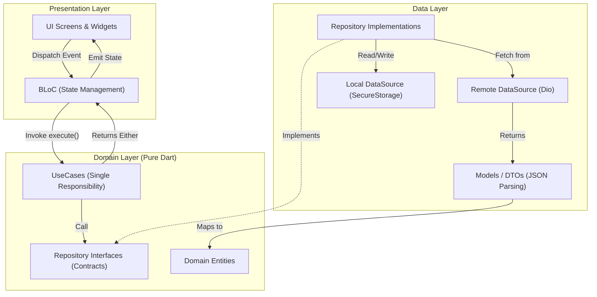
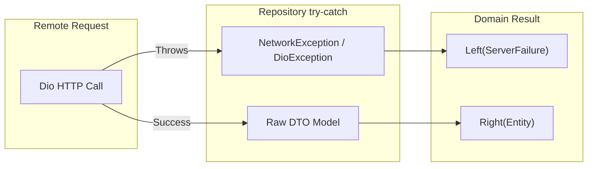

# Architecture & Technical Design Document: `flutter_boilerplate`

* **Package Name:** `flutter_boilerplate`
* **Application ID / Org:** `dev.flutter.boilerplate.anantyan`
* **Target Platforms:** Android, iOS
* **Flutter SDK:** ^3.11.0 / Dart ^3.11.0
* **Author:** anantyan
* **Status:** Proposed / Under Review

---

## 1. Overview

`flutter_boilerplate` is an enterprise-grade, generic starter kit for Flutter applications targeting Android and iOS. Its primary goal is to provide developers with a robust, production-ready foundation that accelerates project bootstrap times from days to minutes.

The boilerplate strictly adheres to **Clean Architecture** principles (separating Domain, Data, and Presentation layers), utilizes **BLoC** (`flutter_bloc`) for predictable and testable state management, implements compile-time Dependency Injection via **`injectable` + `get_it`**, handles declarative strongly-typed navigation via **`auto_route`**, and applies functional error handling with **`dartz`** (`Either<Failure, T>`) coupled with typed **`NetworkException`** over **`dio`**.

To validate and demonstrate the architecture in a tangible, interactive manner, the boilerplate includes two built-in demonstration modules:
1. **Interactive Theme Switcher:** Functional Dark/Light mode toggle in the Top App Bar backed by `ThemeBloc` and persisted across sessions using `flutter_secure_storage`.
2. **Generic Post/Item Feed Module:** An entity-driven interactive feed with timestamp and status chips, dynamic item creation through a Floating Action Button (FAB), and intuitive swipe-to-delete (left swipe with `Dismissible`) handled by `PostBloc`.

---

## 2. Problem Analysis & Goals

### The Problem
When starting new commercial Flutter projects, developers frequently face repetitive setup overhead and architectural drift:
* **Boilerplate Fatigue:** Setting up logging, HTTP clients, authorization interceptors, token refresh, and network error handling takes hours or days.
* **Tight Coupling:** Without clear boundaries, UI widgets often directly call API services or database singletons, preventing effective unit and widget testing.
* **Error Handling Inconsistencies:** Unhandled `DioException` or arbitrary runtime try-catches cause uncaught exceptions and degraded user experience.
* **Fragile Navigation:** String-based routing leads to runtime type errors when passing complex arguments between screens.

### Core Goals
1. **Developer Velocity:** Enable instant feature scaffolding where a new feature only requires implementing its domain contract, data source, and BLoC.
2. **Separation of Concerns:** Business logic in the Domain layer has zero dependencies on Flutter UI or third-party network libraries.
3. **Predictable State & Error Handling:** Explicit functional result types (`Either<Failure, T>`) eliminate hidden runtime exceptions.
4. **Code Generation Efficiency:** Seamless integration with `build_runner`, `injectable_generator`, `auto_route_generator`, and `json_serializable`.

---

## 3. Alternatives Considered

| Decision Area | Chosen Solution | Alternatives Considered | Rationale |
| :--- | :--- | :--- | :--- |
| **Architecture** | **Clean Architecture** | MVC, MVVM (Feature-First simple) | Clean Architecture strictly separates Domain (Enterprise Business Rules) from Data and Frameworks. Highly scalable for teams and automated tests. |
| **State Management** | **BLoC (`flutter_bloc`)** | Riverpod, Provider, MobX | BLoC enforces formal event-driven streams, ensuring clear auditability of state transitions. Widely adopted across corporate codebases. |
| **Dependency Injection** | **`injectable` + `get_it`** | Manual `get_it`, `Provider` tree | `injectable` automates registration with `@injectable`, `@lazySingleton`, eliminating manual factory wiring and human configuration error. |
| **Navigation** | **`auto_route`** | `go_router`, `Navigator 2.0` raw | `auto_route` generates compile-time route classes with strongly typed arguments, declarative route guards, and nested tabs support. |
| **Error Handling** | **`dartz` (`Either<Failure, T>`)** | Raw try/catch, Dart 3 `Result<T>` sealed class | Monadic functional programming via `Either.fold()` guarantees that callers explicitly handle both `Left(Failure)` and `Right(Success)`. |
| **HTTP Client** | **`dio` + Typed Interceptors** | `http` package, `Chopper` | `dio` provides interceptor pipelines for auth token injection, global error mapping, logging, and caching. |
| **Local Storage** | **`flutter_secure_storage`** | `shared_preferences`, `hive` | Hardware-backed encrypted storage (Keychain on iOS, Keystore/EncryptedSharedPreferences on Android) safe for auth tokens and keys. |

---

## 4. Detailed Architectural Design

### 4.1 Folder Structure
```
lib/
├── app.dart                             # Root MaterialApp.router with Theme and Router bindings
├── main.dart                            # App entrypoint, global configuration & DI initialization
├── common/                              # Shared cross-cutting concerns
│   ├── constants/                       # App-wide constants (keys, endpoints, timeouts)
│   ├── errors/                          # Failure domain abstractions & exceptions
│   │   ├── exceptions.dart              # Data-layer exceptions (NetworkException, CacheException)
│   │   └── failures.dart                # Domain-layer failures (ServerFailure, NetworkFailure)
│   ├── network/                         # Dio factory, logging, and error interceptors
│   │   ├── dio_client_factory.dart      # Configured Dio instance provider
│   │   └── error_handling_interceptor.dart # Maps status codes to NetworkException
│   ├── router/                          # AutoRoute configuration and route definitions
│   │   └── app_router.dart
│   ├── storage/                         # Secure storage wrapper service
│   │   └── secure_storage_service.dart
│   └── theme/                           # Color schemes, typography, and theme definitions
│       ├── app_colors.dart
│       ├── app_text_styles.dart
│       └── app_theme.dart
├── di/                                  # Dependency Injection module
│   ├── injection.dart                   # Service locator initialization
│   └── modules/                         # External package registrations (Dio, SecureStorage)
├── data/                                # Data Layer (Implements Domain contracts)
│   ├── datasources/
│   │   ├── local/                       # Local database or secure storage datasources
│   │   └── remote/                      # HTTP/REST API datasources
│   │       ├── api_endpoints.dart
│   │       └── post_remote_datasource.dart
│   ├── models/                          # Data transfer objects (DTO) with JSON serialization
│   │   └── post_model.dart
│   └── repositories/                    # Repository implementations
│       └── post_repository_impl.dart
├── domain/                              # Domain Layer (Pure Dart - No Flutter / External deps)
│   ├── entities/                        # Business domain entities
│   │   └── post_item.dart
│   ├── repositories/                    # Repository abstract contracts
│   │   └── post_repository.dart
│   └── usecases/                        # Single-responsibility business use cases
│       ├── get_posts_usecase.dart
│       ├── create_post_usecase.dart
│       └── delete_post_usecase.dart
└── presentation/                        # UI Layer (BLoC, Screens, Widgets)
    ├── theme/                           # Theme toggle BLoC
    │   ├── theme_bloc.dart
    │   ├── theme_event.dart
    │   └── theme_state.dart
    └── modules/
        └── home/                        # Home Post/Item Feed Feature
            ├── bloc/
            │   ├── post_bloc.dart
            │   ├── post_event.dart
            │   └── post_state.dart
            ├── screens/
            │   └── home_screen.dart
            └── widgets/
                ├── post_item_card.dart
                └── create_post_bottom_sheet.dart
```

---

### 4.2 Data Flow & Layer Interaction



---

### 4.3 Functional Error Handling Pattern

The application enforces functional error handling using `dartz` `Either<Failure, T>`:
* **Left(`Failure`):** Represents an operational or business failure (e.g. `ServerFailure`, `NetworkFailure`, `CacheFailure`, `ValidationFailure`).
* **Right(`T`):** Represents the successful payload (e.g. `List<PostItem>`, `PostItem`, `void`).



### 4.4 Sample Module Specifications

#### 1. Theme Module (`ThemeBloc`)
* **Events:**
  * `ThemeEvent.loadInitialTheme()`: Reads persisted theme (`ThemeMode.system`, `light`, or `dark`) from secure storage.
  * `ThemeEvent.toggleTheme()`: Toggles between Light and Dark mode, saves preference, and updates MaterialApp.
* **Top App Bar Integration:**
  * Displays an animated Sun / Moon icon in the AppBar action bar.
  * Responds immediately with zero app reload lag.

#### 2. Generic Post/Item Feed (`PostBloc`)
* **Entity Model:**
  * `id`: String (UUID)
  * `title`: String
  * `body`: String
  * `status`: Enum (`active`, `pending`, `completed`)
  * `createdAt`: DateTime
* **UI Features:**
  * **Dynamic Creation:** Floating Action Button (FAB) opens an ergonomic modal bottom sheet to input Title, Body, and Status.
  * **Swipe to Delete:** `Dismissible` widget configured with `direction: DismissDirection.endToStart` (swipe left) featuring a red background, trash icon, and SnackBar with Undo action.
  * **Pull-to-Refresh:** Standard `RefreshIndicator` invoking `GetPostsEvent`.

---

## 5. Security & Best Practices

1. **Tokens & Secrets:**
   * Handled exclusively through `FlutterSecureStorage` with hardware-backed encryption flags (`aopts: AndroidOptions(encryptedSharedPreferences: true)`).
2. **Network Resilience:**
   * Connect and receive timeouts configured on Dio (15,000ms).
   * Typed HTTP interceptors mapping status codes (`400`, `401`, `403`, `404`, `500`) to discrete `NetworkException` subclasses.
3. **Immutability & Equality:**
   * Entities and States implement `Equatable` to eliminate redundant widget rebuilds.

---

## 6. Summary of Design

`flutter_boilerplate` provides a production-grade template that eliminates architectural ambiguity:
* Developers can clone and immediately write business features.
* The separation of concerns makes every layer independently unit-testable.
* Modern navigation and DI eliminate manual wiring.
* The sample modules serve as a living reference pattern for all subsequent app features.

---

## 7. Research References

The design decisions and library integrations in this document were formed by researching and reading the official specifications and documentation:

1. **`injectable` Documentation (pub.dev):**
   [https://pub.dev/packages/injectable](https://pub.dev/packages/injectable)
2. **`get_it` Service Locator (pub.dev):**
   [https://pub.dev/packages/get_it](https://pub.dev/packages/get_it)
3. **`auto_route` Declarative Routing (pub.dev):**
   [https://pub.dev/packages/auto_route](https://pub.dev/packages/auto_route)
4. **`flutter_bloc` State Management Library (pub.dev):**
   [https://pub.dev/packages/flutter_bloc](https://pub.dev/packages/flutter_bloc)
5. **`dartz` Functional Programming in Dart (pub.dev):**
   [https://pub.dev/packages/dartz](https://pub.dev/packages/dartz)
6. **`dio` Powerful HTTP Client for Dart (pub.dev):**
   [https://pub.dev/packages/dio](https://pub.dev/packages/dio)
7. **`flutter_secure_storage` Keychain/Keystore plugin (pub.dev):**
   [https://pub.dev/packages/flutter_secure_storage](https://pub.dev/packages/flutter_secure_storage)

