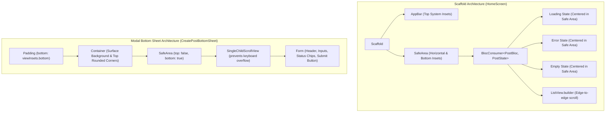

# Technical Design Document: SafeArea Integration for HomeScreen & BottomSheet

* **Author:** Antigravity / Gemini CLI
* **Target Package:** `flutter_boilerplate`
* **Target Branch:** `feature/safe-area-refinement`
* **Status:** Pending User Approval

---

## 1. Overview

This modification incorporates explicit, responsive `SafeArea` handling into the foundational presentation layers of `flutter_boilerplate`:
1. **Base Screen (`HomeScreen` / `HomeView`)**: Protects body content (loading spinners, error views, empty states, and list elements) from device intrusions such as home indicators, gesture bars, navigation pill cutouts, and landscape notches.
2. **Modal Form (`CreatePostBottomSheet`)**: Wraps modal container content in `SafeArea(top: false)` combined with dynamic keyboard insets (`MediaQuery.viewInsetsOf(context).bottom`) and `SingleChildScrollView` to eliminate UI clipping at the bottom edge and prevent `RenderFlex overflow` when the virtual keyboard is active.

---

## 2. Detailed Problem Analysis

### 2.1 Base Screen Layout
In modern mobile hardware (iPhone models with Dynamic Island / Home Indicator and modern Android gesture navigation bars):
- The `Scaffold.appBar` natively protects the top status bar.
- However, the `Scaffold.body` by default renders down to the bottom glass of the physical display.
- Consequently, centered loading indicators (`CircularProgressIndicator`), error states, and empty state illustrations can be visually offset or collide with the bottom navigation pill or gesture bar.
- On landscape orientations, content can collide with side notches or camera cutouts if horizontal safety insets are omitted.

### 2.2 Modal Bottom Sheet Layout
In `CreatePostBottomSheet`:
- When launched via `showModalBottomSheet(isScrollControlled: true)`, the sheet sits directly on the display bottom.
- Without explicit bottom safe area padding, the primary action button (`Simpan Item Baru`) hugs the bottom bezel and collides with the iOS Home Indicator bar.
- When focused, if the software keyboard emerges, insufficient scroll management can cause `RenderFlex` pixel overflows on smaller devices or localized keyboards.

---

## 3. Alternatives Considered

| Approach | Pros | Cons | Decision |
| :--- | :--- | :--- | :--- |
| **Approach A: Native `useSafeArea: true` parameter on `showModalBottomSheet`** | Built-in parameter in Flutter's `showModalBottomSheet`. | Applies padding *outside* the sheet container, resulting in an unstyled background gap beneath the modal sheet rounded container on iOS. | **Rejected** |
| **Approach B: Hardcoded bottom padding (e.g. `EdgeInsets.only(bottom: 34)`)** | Simple to implement. | Breaks on Android devices with physical navigation buttons or varying system bar heights; wastes vertical space on devices without home bars. | **Rejected** |
| **Approach C: Explicit `SafeArea` inside sheet container + `SafeArea` wrapping `Scaffold.body`** | Preserves background sheet surface all the way to the bottom edge while insetting content safely across all platforms, orientations, and keyboard states. | Requires careful coordination with `MediaQuery.viewInsetsOf(context).bottom` to prevent double-padding when keyboard opens. | **Adopted (Recommended)** |

---

## 4. Detailed Design & Architecture

### 4.1 Modifications to `lib/presentation/modules/home/widgets/create_post_bottom_sheet.dart`
- In `show(...)`: ensure `isScrollControlled: true` remains set, `useSafeArea: false` (to allow modal backdrop to touch bottom edge smoothly).
- In `build(...)`:
  - Outer `Padding`: `EdgeInsets.only(bottom: MediaQuery.viewInsetsOf(context).bottom)`.
  - Inner content inside `Container`: wrapped with `SafeArea(top: false, child: SingleChildScrollView(child: Form(...)))`.
  - Result: The container's colored surface extends to the bottom screen edge, while the form fields and "Simpan Item Baru" button are comfortably elevated above the iOS Home Indicator.

### 4.2 Modifications to `lib/presentation/modules/home/screens/home_screen.dart`
- In `HomeView.build(...)`:
  - Wrap `BlocConsumer<PostBloc, PostState>` with `SafeArea`.
  - Set `SafeArea(top: false)` (since `AppBar` already insets top) to protect bottom and sides.
  - Ensures centered states (`PostLoading`, `PostFailure`, empty state) are mathematically centered within the usable viewport without home bar collisions.

---

## 5. Summary of Design

- **Predictable Behavior**: Zero pixel collisions with iOS Home Indicator, Dynamic Island, or Android gesture pill.
- **Responsive Keyboard Handling**: Seamless transition between closed keyboard (padded by `SafeArea`) and open keyboard (elevated by `viewInsets.bottom`).
- **Clean Architecture Integrity**: Changes are confined strictly to the `presentation/` layer (`widgets/` and `screens/`), preserving pure Dart domain rules.

---

## 6. References & Research

- [Flutter Material `showModalBottomSheet` Documentation](https://api.flutter.dev/flutter/material/showModalBottomSheet.html)
- [Flutter Widgets `SafeArea` Class Documentation](https://api.flutter.dev/flutter/widgets/SafeArea-class.html)
- [Flutter Issue #18564: Modal Bottom Sheet and Keyboard Avoidance](https://github.com/flutter/flutter/issues/18564)
- [Flutter Issue #96944: useSafeArea behavior in showModalBottomSheet](https://github.com/flutter/flutter/issues/96944)
